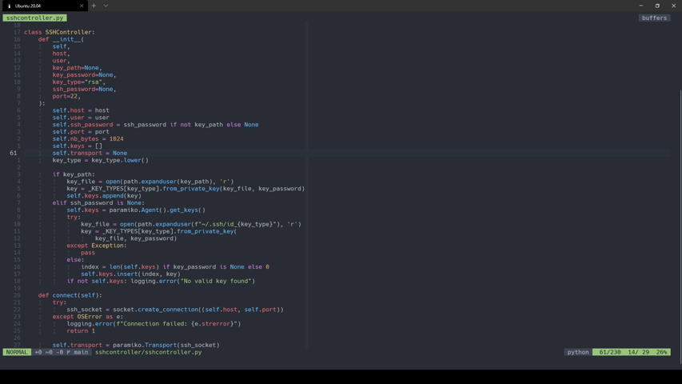

# nvim-lspfuzzy

This plugin makes the Neovim LSP client use
[FZF](https://github.com/junegunn/fzf)
to display results and navigate the code.

It works by redefining LSP handlers so that they call FZF. Therefore
you don't need to change any of your exising LSP mappings. It's also **small**
(currently at ~160 SLOC) and **written entirely in Lua**.

The plugin is compatible only with Neovim 0.5+.



## Installation

#### With Packer
In your *plugins.lua*:
```lua
cmd 'packadd packer.nvim'
return require('packer').startup(function()
  use {
    'ojroques/nvim-lspfuzzy',
    requires = {
      {'junegunn/fzf'},
      {'junegunn/fzf.vim'},  -- to enable preview (optional)
    },
  }
end)
```

#### With Plug
In your *.vimrc* or *init.vim*:
```vim
call plug#begin()
Plug 'junegunn/fzf', {'do': {-> fzf#install()}}
Plug 'junegunn/fzf.vim'  " to enable preview (optional)
Plug 'ojroques/nvim-lspfuzzy', {'branch': 'main'}
call plug#end()
```

#### With Paq
[Paq](https://github.com/savq/paq-nvim) is a lightweight package manager for
Neovim. In your *init.lua*:
```lua
cmd 'packadd paq-nvim'
local paq = require('paq-nvim').paq
paq 'junegunn/fzf'
paq 'junegunn/fzf.vim'  -- to enable preview (optional)
paq 'ojroques/nvim-lspfuzzy'
```

## Usage
Simply add this line to your *init.lua*:
```lua
require('lspfuzzy').setup {}
```

If you're using a *.vimrc* or *init.vim*, you need to enclose that line in a
lua block:
```vim
lua << EOF
require('lspfuzzy').setup {}
EOF
```

By default the following FZF commands are available:
* `tab`: select multiple entries
* `shift+tab`: deselect an entry
* `ctrl-a`: select all entries
* `ctrl-d`: deselect all entries
* `ctrl-t`: go to location in a new tab
* `ctrl-v`: go to location in a vertical split
* `ctrl-x`: go to location in a horizontal split

## Configuration
You can pass options to the `setup()` function. Here are all available options
with their default settings:
```lua
require('lspfuzzy').setup {
  methods = 'all',         -- either 'all' or a list of LSP methods (see below)
  fzf_options = {},        -- options passed to FZF
  fzf_action = {           -- additional FZF commands
    ['ctrl-t'] = 'tabedit',  -- go to location in a new tab
    ['ctrl-v'] = 'vsplit',   -- go to location in a vertical split
    ['ctrl-x'] = 'split',    -- go to location in a horizontal split
  },
  fzf_modifier = ':~:.',   -- format FZF entries, see |filename-modifiers|
  fzf_trim = true,         -- trim FZF entries
}
```

The FZF commands are determined as follows:
1. Commands passed to the `fzf_action` option when calling `setup()` are used
  first.
2. Otherwise the plugin will try to load commands from the FZF option
  `g:fzf_action` if it's set.
3. Finally the default commands will be used.

## Supported LSP methods
You can enable FZF only for a subset of LSP methods by passing them as a list
to the `methods` option when calling `setup()`. The supported LSP methods are:
```
callHierarchy/incomingCalls
callHierarchy/outgoingCalls
textDocument/declaration
textDocument/definition
textDocument/documentSymbol
textDocument/implementation
textDocument/references
textDocument/typeDefinition
workspace/symbol
```

## Troubleshooting

#### Preview does not work
You need to install [fzf.vim](https://github.com/junegunn/fzf.vim) to enable
previews. If it's already installed, make sure it's up-to-date. The plugin
checks that `g:loaded_fzf_vim` is set, which was defined
[in this commit](https://github.com/junegunn/fzf.vim/commit/636a62f140181f80c8e7460a76ae6a5d2c5d97b2).

#### Using the `fzf_modifier` option breaks the plugin
The plugin uses the filename embedded in the FZF entry selected by the user
to jump to the correct location. Therefore it must resolve to a valid path.
For instance `:.` or `:p` can be used but not `:t`.

## License
[LICENSE](./LICENSE)
